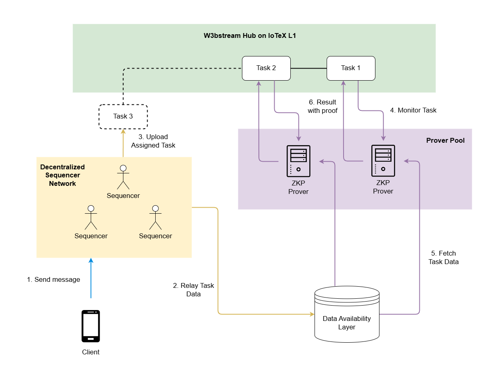

# W3bstream

## Overview

W3bstream is a key Layer-2 solution within the IoTeX ecosystem, designed to support verifiable data processing for Decentralized Physical Infrastructure Networks (*DePINs*). It operates through a network of *Sequencer nodes* and *Prover nodes*.

## Workflow

  

**Sequencer nodes** assemble received data messages with a “block header” that (among other things) references the previous block of data. Each block of data is mined using a proof-of-work mechanism and is then assigned as a Task to a Prover node that is available for data computation. Sequencer nodes receive rewards in IOTX for the mining activity.

**Prover nodes** fetch their tasks and process the task data to generate Zero-Knowledge (ZK) proofs, using circuits that are specific to the DePIN project associated with the data. Prover nodes will receive rewards denominated in the token of the DePIN project for which the proof was generated.

The chain of tasks and their ZK-proofs are recorded **on the IoTeX blockchain**, making them accessible for dApps. The actual data, uniquely referenced by the on-chain tasks, remains available for full off-chain verification.

This architecture ensures secure, reliable, and scalable data processing, allowing DePIN dApps to act on verified real-world facts to trigger blockchain-based incentives.

## Running nodes
 > ⓘ **Note**: Joining the W3bstream network as a sequencer or prover node is currently unavailable. Stay tuned for updates in future releases. [Follow us on X](https://x.com/iotex_dev).

## Get Started for Builders

[Deploy a simple zk prover to W3bstream →](./docs/QUICK_START.md)

[Build your custom zk prover for W3bstream →](./docs/DEVELOPER_GUIDE.md)

## Docker images

[Sequencer Node →](https://github.com/iotexproject/w3bstream/pkgs/container/w3bstream-sequencer)

[Prover Node →](https://github.com/iotexproject/w3bstream/pkgs/container/w3bstream-prover)

## Contract Deployments

 [smartcontracts/README.md](./smartcontracts/README.md#deployment)

## Contributing

We welcome contributions!

Please read our [contributing guidelines](./docs/CONTRIBUTING.md) and submit pull requests to our GitHub repository.
